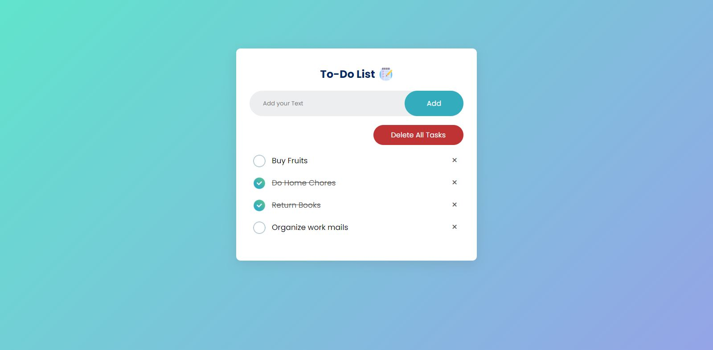

# To-Do App

This is a simple and minimalistic To-Do app created using HTML, CSS, and JavaScript. The app allows you to add tasks to a list, mark tasks as complete, delete tasks, and clear all completed tasks. The app utilizes local storage to save your to-do list, so your list will persist even if you close the app.

## Features

- Add tasks to the list
- Mark tasks as complete
- Delete individual tasks
- Clear all completed tasks
- Uses local storage to save your list

## Getting Started

To get started with the app, simply download or clone the repository, and open the index.html file in your web browser. Once you have the app open, you can start adding tasks to your list.

## Usage

To add a task, simply type your task into the input field and hit the "Add" button. Your task will be added to the list.

To mark a task as complete, simply click the checkbox next to the task. The task will be crossed out to indicate that it has been completed.

To delete an individual task, hover over the task and click the "X" button that appears on the right side of the task.

To clear all completed tasks, click the "Clear Completed" button at the bottom of the list.

## Technologies Used

- HTML
- CSS
- JavaScript
- Browser Local storage

## Credits

This app was created by M.Shahbaz.